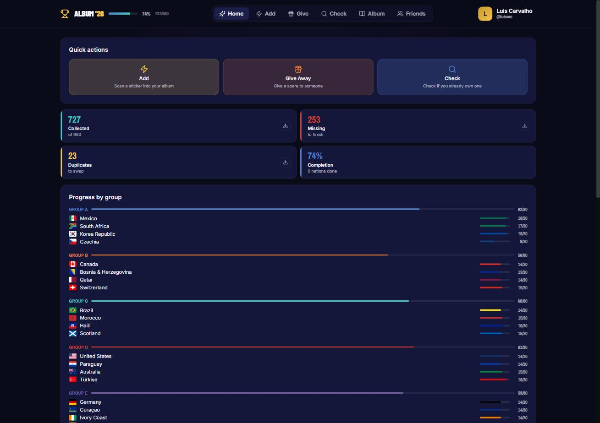
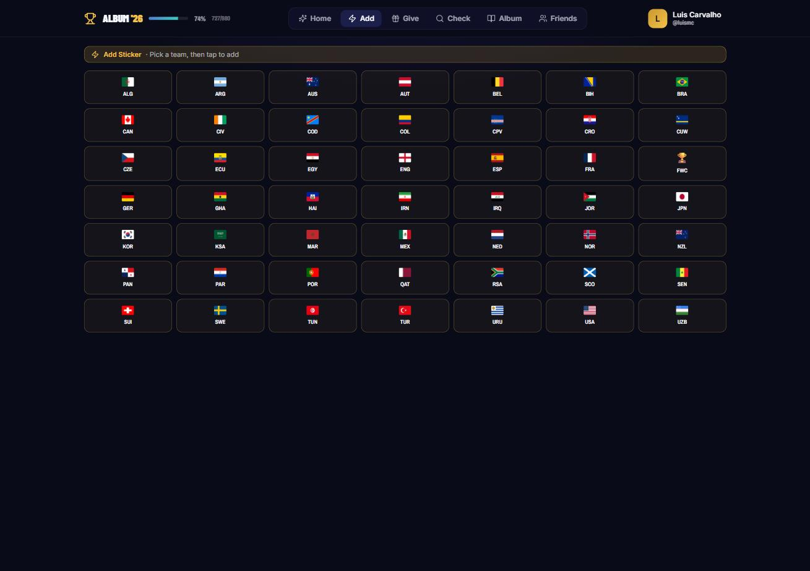
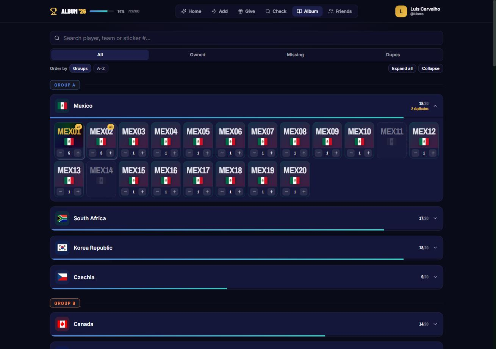
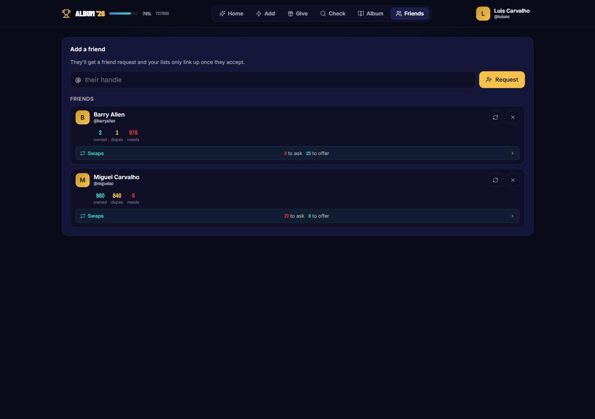
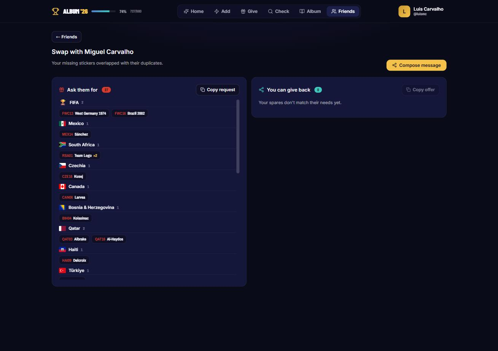

<div align="center">

# ⚽ ALBUM '26

### 980 stickers. 48 nations. One very determined kid.

**[👉 Open the app — ffwc26.luismc.net](https://ffwc26.luismc.net/)**


</div>

---

## The story

This started as a pet project.

My kid and I bought the Panini FIFA World Cup 2026 album, and within about a week we were drowning. Piles of doubles on the kitchen table. A crumpled paper checklist that was already wrong. Standing in a shop with a packet in hand, squinting at a phone, going *"do we have MEX 14 or not?"*

So one weekend I built us a tracker. Now it lives at **[ffwc26.luismc.net](https://ffwc26.luismc.net/)** and other people use it too. 🎉

If you're a parent, a collector, or a nine-year-old with strong opinions about foil stickers — it's free, it's yours, go finish your album.

---

## 📸 Take a look

### Know exactly where you stand

Open the app and the whole album is right there: how many you've got, how many you still need, how many doubles are burning a hole in your pocket, and which groups are nearly done.



### Add stickers as fast as you can open packets

Tap a nation, tap a number. Done. No menus, no forms, no typing. Fast enough to keep up with a kid tearing through five packets in a row.



### Your whole album, one tap away

Every team, every slot, every double. Search by player, team or sticker number. Filter to just what's missing when you're standing at the counter deciding whether to buy one more packet.



### Add your swap crew

Cousins, classmates, the neighbour's kid, the dad from football practice. Add them by handle and your lists quietly link up.



### The bit that actually finishes albums 🤝

This is the magic trick. The app takes your missing list, overlaps it with your friend's doubles, and hands you the exact swap: **here's what to ask for, here's what you can give back.** One tap to copy it or fire it straight into WhatsApp.

No more spreading 200 stickers across the floor to figure out who needs what.



---

## ✨ What it does

🏆 **All 980 stickers, real names** — 9 intro foils, 11 FIFA Museum foils, and 48 nations × 20, with the actual player names off the official checklist

⚡ **Add in two taps** — nation, number, in. Tells you instantly whether it's a new one or a double

🎁 **Give Away mode** — hand a spare to a friend and take it off your pile in one tap

🔍 **Check mode** — the shop-aisle lifesaver. "Do we already have this one?" Answered in a second

📊 **Progress that motivates** — completion percentage, group-by-group bars, and the nations you're closest to finishing

🤝 **Swap matching** — automatic overlap of your needs and their spares, with a ready-to-send WhatsApp or email message

📄 **PDF lists** — export your missing / collected / duplicate lists to a clean A4 sheet. Print it, fold it, stick it in the album

☁️ **Follows you everywhere** — phone in the shop, tablet on the sofa, laptop at the table. Same collection, always in sync

🔒 **You choose what's shared** — show your doubles but hide your missing list, or share nothing at all. Your call

---

## 🚀 Getting started (30 seconds)

1. Go to **[ffwc26.luismc.net](https://ffwc26.luismc.net/)**
2. Sign up with your email
3. Pick a `@handle` — that's how friends find you
4. Start tapping in stickers

That's it. No app store, no install, no cost.

---

## 🛠️ For the tinkerers

Built with React 18, Vite and Firebase. Everything lives in `src/App.jsx` — sticker data, components, the lot.

```bash
git clone https://github.com/YOUR_USERNAME/wc26-sticker-tracker.git
cd wc26-sticker-tracker
npm install
cp .env.example .env.local   # your Firebase config goes here
npm run dev
```

<details>
<summary><strong>Album structure & customising the checklist</strong></summary>

**980 stickers:**

| Section | Count |
|---------|-------|
| Introduction (foils) | 9 |
| FIFA Museum (foils) | 11 |
| 48 nations × 20 | 960 |
| **Total** | **980** |

Per team: `#1` Team Logo (foil) · `#2–12` Players · `#13` Team Photo · `#14–20` Players

**Fixing a name?** Player names live in the `TD` array near the top of `src/App.jsx`:

```js
["CODE", "Team Name", "Group", "Confederation", "🇫🇱", "#color1", "#color2", [
  "Player 1", ..., "Player 18"   // 18 players per team
]]
```

Edit it directly if Panini issues a correction or you spot a typo. PRs welcome.

</details>

<details>
<summary><strong>Environment variables</strong></summary>

From Firebase Console → Project Settings → Your Apps → Web app config:

```
VITE_API_KEY=...
VITE_AUTH_DOMAIN=...
VITE_PROJECT_ID=...
VITE_STORAGE_BUCKET=...
VITE_MESSAGING_SENDER_ID=...
VITE_APP_ID=...
```

Then `npm run build && firebase deploy`.

</details>

---

<div align="center">

**Not affiliated with Panini or FIFA.** Just a dad, a kid, and 253 stickers still to go.

MIT · [ffwc26.luismc.net](https://ffwc26.luismc.net/)

</div>
